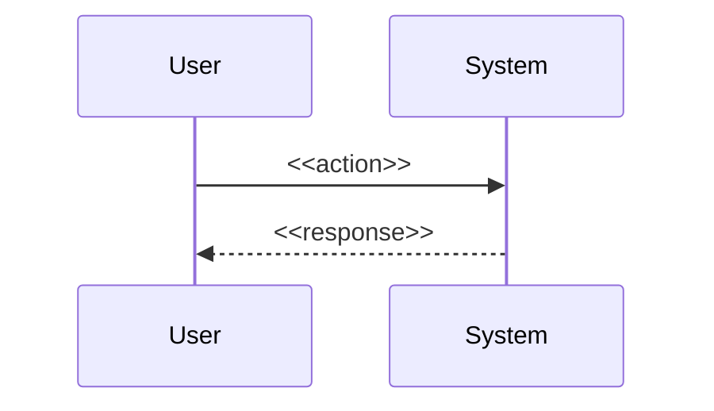

# PRD: <<feature-name>>

## Context / Problem

### Executive Summary

<<1-2 sentences. What this is, in plain language, for a reader who will not read further.>>

### Problem Statement

<<What problem exists today? Who feels it? Frame as the gap between current state and desired state. One paragraph.>>

### Business Value

<<What outcome does solving this produce? Tie to a measurable business metric (revenue, retention, cost, latency, compliance). Avoid abstract value claims.>>

### Strategic Alignment

<<How does this fit the product or platform strategy? Reference the relevant strategy doc or initiative. If no explicit strategy doc exists, state the implicit alignment in one sentence.>>

### Target Audience & Personas

- **Primary persona:** <<who uses this directly>>
- **Secondary persona:** <<who benefits indirectly>>
- **Constraints audience:** <<who must approve, maintain, or operate this>>

### User Stories

- As a <<persona>>, I want <<capability>>, so that <<outcome>>.
- As a <<persona>>, I want <<capability>>, so that <<outcome>>.

## Scope

### In-Scope — Functional Requirements

Priority uses MoSCoW. Each requirement is atomic and testable.

- **Must:** <<requirement>>
- **Must:** <<requirement>>
- **Should:** <<requirement>>
- **Could:** <<requirement>>

### Out-of-Scope — Explicit Exclusions

- <<what is deliberately not built, and why>>
- <<what is deferred to a later phase, with the deferral reason>>

## Procedure / Steps

### UX / UI Flow

<<Describe the user-visible flow. If no UI, describe the operator-visible flow. Use a numbered list or a mermaid sequence diagram.>>

### User Journey

1. <<entry state>>
2. <<action>>
3. <<outcome>>

### Feature Breakdown

- **<<component 1>>** — <<responsibility>>
- **<<component 2>>** — <<responsibility>>

## Evidence / Results

### Success Metrics

- **North Star Metric:** <<the single metric that proves the feature worked>>
- **Guardrail Metrics:** <<metrics that must not regress while pursuing the North Star>>
  - <<metric>>: baseline <<value>>, ceiling <<value>>

### Acceptance Criteria

- AC1: Given <<precondition>>, When <<action>>, Then <<result>>.
- AC2: Given <<precondition>>, When <<action>>, Then <<result>>.

## Failure Modes / Boundaries

### Assumptions

- <<assumption, with why it is safe to assume>>

### Risks

- **<<risk>>** — <<impact>> | mitigation: <<action>>

### Constraints

- <<technical, organizational, or temporal constraint>>