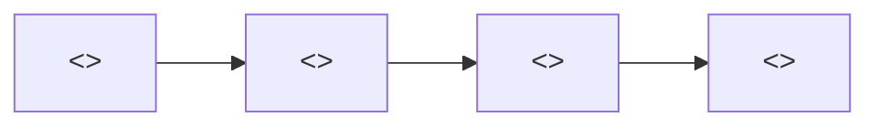

# RFD: <<feature-name>>

## Context / Problem

### Background

<<1-2 paragraphs. What exists today, what forces are driving change, and why now.>>

### Current State

<<Describe the system as it is today. Reference real files, services, data flows. Do not idealize.>>

### Problem the design solves

<<One paragraph. Restate the architectural problem distilled from the PRD. The PRD defines the "what"; this section defines the architectural "what-for".>>

### References PRD

Link: [`./prd.md`](./prd.md)

## Scope

### Design Scope

<<What architecture this RFD covers. Name the systems, boundaries, and interfaces in scope. State what architectural concerns are explicitly out of scope (e.g., UI design, marketing).>>

## Procedure / Steps

### Proposed Architecture

<<Describe the target architecture in prose, then render it as a topology diagram.>>



### Component Breakdown

- **<<component 1>>** — <<responsibility>> | tech: <<technology>> | owns: <<data>>
- **<<component 2>>** — <<responsibility>> | tech: <<technology>> | owns: <<data>>

### Technology Stack

| Layer | Choice | Justification |
|---|---|---|
| <<layer>> | <<technology>> | <<why this, not the obvious alternative>> |

### Data Models

<<Schema sketches. Use inline code blocks for entity definitions.>>

```text
<<EntityName>>
  id: <<type>>
  <<field>>: <<type>>
  <<field>>: <<type>>
```

### Migration Plan

1. <<step to move from current state to target state>>
2. <<step>>
3. <<step>>

## Evidence / Results

### Alternatives Considered

- **Alternative A: <<name>>**
  - Pros: <<list>>
  - Cons: <<list>>
  - Why rejected: <<reason>>
- **Alternative B: <<name>>**
  - Pros: <<list>>
  - Cons: <<list>>
  - Why rejected: <<reason>>

### Trade-off Analysis

<<Which quality attributes are traded against which, and why the trade is acceptable in this context.>>

### Decision Rationale

<<One paragraph. Why the proposed architecture is the right answer given the alternatives and trade-offs.>>

## Failure Modes / Boundaries

### Known Limitations

- <<what this architecture cannot do, by design>>

### Risks

- **<<risk>>** — <<impact>> | mitigation: <<action>>

### Open Questions

- <<question that must be resolved before or during implementation>>