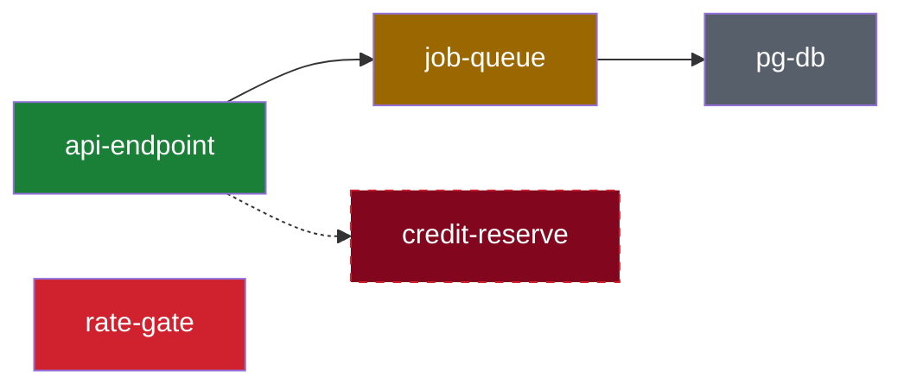
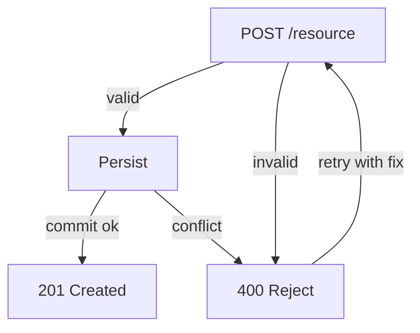
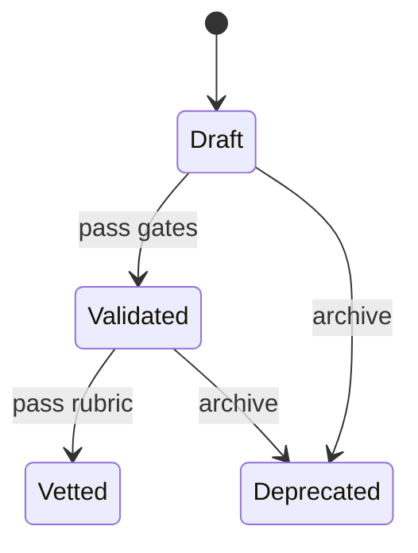
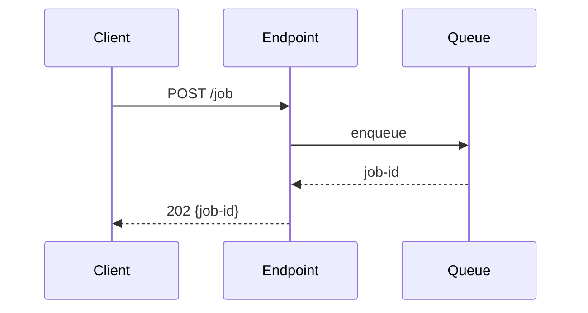
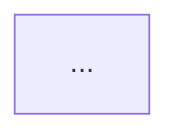
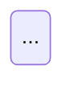

# change-impact-diagram

Diagrams the impact of a code change on the system and its primitives. Produces four diagram types, each grounded in the diff or the plan. Markdown-rendered (mermaid + tables) — no external service, no deployment.

## What this answers

How does this change touch the system? Which primitives, what kind of impact, and what flows does it produce? The output is visual, scannable, and grounded — every edge traces to a code path or a stated plan decision.

## Three modes, one diagram set

| Mode | Trigger | Output | Grounding |
|---|---|---|---|
| `plan` | Before or while implementing | Repo markdown file (plan/spec section) | Intent — describes intended impact |
| `recap` | PR creation or meaningful update | PR description (marker-delimited block) | `git diff <base>...HEAD` — actual impact |
| `chat` | Quick impact question mid-session | Chat message (inline) | Session context + targeted code read |

All three produce the same diagram types. Mode controls depth, grounding source, and whether the block is marker-delimited.

## Source of truth — primitives map (non-negotiable)

Every classification must be checked against a primitives map. Two sources, in order:

1. **`primitives.yaml` if present and fresh** — a verified cache, not static documentation. The source of truth is the code; the yaml is a cache. Use its `id` values verbatim, but only after a cheap drift check passes (see below). If the PR adds, removes, or materially reshapes a primitive, update `primitives.yaml` and its `last_verified` field in the same PR and say so in the block.
2. **Map from source via `prompts/repo-primitive-audit/prompt.md`** — run the full prompt (map + breakdown + review) and use the **review-verified map** as the primitives source. The review phase is what validates the map; skip it and the map may itself be fiction. Invoke with `{{REVIEW_PLAYBOOK}}` set to the repo's adversarial-code-review (or a narrower map-vs-source consistency check if one exists).

### Drift check for cached maps (validate, don't trust)

Before trusting an existing `primitives.yaml`, run three cheap checks against source:

1. **Path check** — do the file paths in each primitive's `code` entries still exist?
2. **Mtime check** — have any files under a primitive's `code` paths changed since the map's `last_verified` timestamp?
3. **Structure check** — has the top-level directory shape changed (new/removed dirs) since the map was written?

All three pass → use the cached map, high confidence.
Any fail → the map is stale. Two branches by mode:
- **chat mode** — flag low confidence, use the stale map with a visible `stale` marker, produce diagrams but mark classification as unverified.
- **plan/recap mode** — block on the stale map, run repo-primitive-audit to regenerate, update `primitives.yaml` and `last_verified` in the same PR.

This makes the expensive full audit run only when drift is detected, not every time.

### `primitives.yaml` schema

```yaml
last_verified: 2026-07-30        # mtime comparison anchor for drift check
verifier: repo-primitive-audit   # how this was generated

primitives:
  - id: api-endpoint             # verbatim id used in the block
    group: surfaces
    code:                        # paths validated by the drift check
      - apps/web/src/routes/api.chat.ts
    description: "POST /api/chat — chat turn entrypoint"

  - id: budget-gate
    group: spend-gate
    code:
      - apps/web/src/lib/chat/credits/budget-gate.ts
    description: "Pre-turn budget cap enforcement"
```

The `code` paths are what the drift check validates. Without them the cache cannot be verified.

### Confidence by mode and map source

| Mode | Map source | Classification confidence |
|---|---|---|
| recap | `primitives.yaml` (drift-checked, fresh) | High |
| recap | repo-primitive-audit (review-verified) | High |
| plan | `primitives.yaml` (drift-checked, fresh) | High |
| plan | repo-primitive-audit (review-verified) | High |
| chat | `primitives.yaml` (drift-checked, fresh) | High |
| plan | improvised from issue/spec + session context | **Medium — state this, and state the risk range (see below)** |
| chat | improvised from scoped code read | **Medium — state this in the output** |
| any | stale `primitives.yaml` (drift detected) | **Low — mark classification as unverified** |
| any | no map available | None — produce diagrams only, do not classify |

Plan mode with an improvised map is riskier than chat mode with one: plan mode is where you decide *whether* to do something, and an unverified map there can be wrong by a full risk level (a feature that reads as `composes` against an assumed structure may be `adds` against the real one). If plan mode can't get a verified map, state medium confidence and a risk range (see below), not a single classification.

Classification without a verified map is fiction. If no map is available and the mode can't run repo-primitive-audit (chat), say "no verified primitives map — classification withheld" and produce only the diagrams that don't require it.

## Risk classification

Classify each touched primitive, then roll up to the highest severity as the overall classification (`adds` > `removes` > `extends` > `composes`):

| Classification | Meaning | Risk |
|---|---|---|
| `composes` | Uses existing primitives as-is; wiring and call sites only | Low |
| `extends` | Changes a primitive's behavior, shape, or contract | Medium |
| `adds` | Introduces a new primitive (must update primitives map) | High |
| `removes` | Deletes a primitive (code paths removed, not just deprecated) | High |

A change touching invariants from the primitives map (for example per-user isolation) is called out explicitly regardless of classification.

### Plan-mode classification: state a risk range, not a single value

In plan mode, the decision graph branches represent outcomes the implementation must choose between. Each branch may carry a different classification. The plan-mode classification must state the **range** across those branches, not a single value picked from one.

Format: `composes (low) to adds (high) depending on <decision graph branch>`

Example — a plan with a client-side vs server-side decision:
- ❌ `composes (low risk)` — picks the low branch, hides the high-risk path
- ✅ `composes (low) to adds (high) depending on filter location (client-side vs server-side + migration)` — mirrors the decision graph

The decision graph already diagrams the fork. The classification should mirror it. A single-value plan-mode classification that ignores a high-risk branch is the same failure mode as the footgun: it looks grounded but hides a path the implementer may take.

## Four diagram types

Each answers a distinct question. Omit a diagram rather than leaving it empty. A diagram with no grounded edges is worse than no diagram.

### 1. System map — `flowchart`, color-coded by impact

Shows touched primitives + immediate neighbors from the map, not the whole graph. Color = semantic: touched (composes), extended, added, removed (deleted), untouched (context only).



### 2. Decision graph — `flowchart` with labeled branches

The novel piece. Models "A can produce B or C, B can produce D or C." Edge labels carry conditions. In plan mode, conditional edges represent possible outcomes the implementation must choose between. In recap mode, they represent branches the diff actually introduces.



### 3. State map — `stateDiagram-v2`

Before/after state transitions the change introduces or shifts. Use when the change alters a lifecycle, a status field, or a state machine. A change that adds a state, removes a state, or shifts a transition earns this diagram.



### 4. Endpoint interaction — `sequenceDiagram`

Request/response flow across endpoints and components affected by the change. Use when the change crosses a process, service, or handler boundary. Internal-only changes with no endpoint surface omit this diagram.



## Block format

### recap mode — marker-delimited, collapsible, fixed section order

A future ingestion process parses this structure. Omit optional sections rather than leaving them empty.

````markdown
<!-- change-impact:start -->

### Change impact

 

<details>
<summary>Change impact — <b>removes a primitive, adds another</b> (high risk)</summary>

**Mode:** recap · **Base:** `main` @ `abc1234` · **Head:** `def5678`

**Classification:** removes + adds — deletes `credit-reservation`, introduces `budget-gate`.

### Primitives touched

| Primitive | Group | Impact |
|---|---|---|
| `api-endpoint` | surfaces | composes |
| `job-queue` | messaging | extends — new `retry_count` field |
| `credit-reservation` | spend-gate | removes — prepaid balance deleted |
| `budget-gate` | spend-gate | adds — replaces reservation as sole gate |

### System map



### Decision graph


### State map



### Endpoint interaction

```mermaid
sequenceDiagram
    ...
```

</details>

<!-- change-impact:end -->
````

Format rules:
- A `### Change impact` heading sits above the `<details>` — always visible, titles the block for a reviewer scanning the PR.
- The shields badges sit on their own line between the heading and the `<details>`, separated by blank lines. They are always visible (not inside the collapsible). Shield URLs follow the mapping below.
- The `<summary>` line carries the overall classification and risk in bold so reviewers see it without expanding the block.
- Blank line after `<summary>` and around every fenced block, or GitHub will not render the markdown/mermaid inside `<details>`.
- System map: show touched primitives plus their immediate neighbors from the map — not all ~25 nodes. Color with the five `classDef` styles (`touched`, `extended`, `added`, `removed`, `untouched`). Use dotted edges `-.->` for deleted paths when overlaying what was removed. Quote node labels containing spaces or special characters.
- Keep the whole block scannable: prefer tables and diagrams over prose, and keep it well under ~120 lines.

### Shield badge mapping

Two badges sit on their own line above the `<details>`: risk level + operation type. The op badge may combine operations with `_` (e.g. `adds_removes`).

| Classification | Risk badge | Op badge |
|---|---|---|
| `adds` | `` | `` |
| `removes` | `` | `` |
| `adds` + `removes` | `` | `` |
| `extends` | `` | `` |
| `composes` | `` | `` |
| plan (range) | `` | `` |
| stale / unverified | `` | `` |

Risk and op badges share color when they agree; diverge when ambiguous (plan = yellow + blue, stale = orange + yellow). Badge divergence is a visual signal that the classification needs attention.

The badges are decoration — if shields.io is down, they degrade to broken image alt-text (`risk` / `op`) and the `<summary>` text still carries the full classification. No information is lost.

### plan mode — same sections, no markers, no `<details>`

Written as a section of the plan/spec with a heading and the same badges line:

```markdown
## Change impact

 

### composes to adds (low to high risk, depends on filter location)

**Mode:** plan · **Intended impact:** ...
```

Same four diagram sections follow. Conditional edges in the decision graph represent possible outcomes the implementation must choose between — the decision points the plan must resolve.

### chat mode — inline, no markers, no wrapper

Return only the diagram(s) the question calls for. No `<details>`, no markers, no fixed section order. If the user asks "what does this change touch?" — system map only. If they ask "what flows from this endpoint?" — endpoint interaction only. Match the diagram to the question.

## Workflow

### recap mode (PR create/update)

1. Establish the primitives map: if `primitives.yaml` exists, run the drift check (path + mtime + structure). Fresh → use it. Stale → run `prompts/repo-primitive-audit/prompt.md` in full (map + breakdown + review), use the review-verified map, and update `primitives.yaml` + `last_verified` in the same PR. No yaml → run repo-primitive-audit in full.
2. Get the facts: `gh pr view <n> --json baseRefName,headRefName`, then `git diff <base>...HEAD --stat` and the full diff for anything you did not author this session.
3. Map changed paths to primitives via the map's `code` entries; classify each; roll up the overall classification.
4. Author the four diagrams following the specs above. Omit any diagram with no grounded edges.
5. Upsert the block into the PR description:

   ```bash
   node skills/change-impact-diagram/scripts/upsert-impact-block.mjs <pr-number> <block-file>
   ```

   The script replaces the content between the markers, or appends the block on first run. It never touches text outside the markers.

6. Re-run steps 2-5 after pushing significant new commits to the PR.

### plan mode

Same steps, except: `**Mode:** plan`, no Base/Head commits required, "Primitives touched" describes intended impact, and the decision graph's conditional edges represent outcomes the plan must resolve. **Classification must state a risk range tied to the decision graph branches, not a single value** (see "Plan-mode classification" above). Write the block as a section of the plan/spec file (not the PR description). Add a one-line note when the plan requires **no** change to any primitive — that is the lowest-risk outcome and worth stating explicitly. When implementation later diverges, the recap's "Plan vs actual" section (see below) records the drift.

### chat mode

Read only the code the question scopes to. Produce only the relevant diagram(s). No markers, no wrapper, no fixed order. Return inline.

## Plan vs actual (recap mode only, when a plan-mode block existed)

When a prior plan-mode block exists, recap mode adds a short list: what shipped as planned and what drifted. This is the only section that compares plans to reality; everything else describes the actual diff.

## Footgun

Inventing diagram edges that aren't grounded in the diff (recap) or the plan (plan mode). A decision graph with speculative branches is fiction, not impact analysis. Every edge must trace to a code path or a stated plan decision. If you cannot point to where an edge comes from, omit it.

The same applies to the primitives map. A map that hasn't been review-verified (the review phase of repo-primitive-audit) is a hypothesis, not a map. Classifying against an unverified map produces unverified classification — which is the root failure mode: ungrounded edges trace back to an unverified map. The drift check exists to catch this for cached maps; a stale `primitives.yaml` used without re-verification is the same failure as no map at all.

## Related artifacts

- `prompts/repo-primitive-audit/` — the primitives map source. Run in full (map + breakdown + review) when no `primitives.yaml` exists or when a cached map is stale. The review phase validates the map.
- `docs/references/change-impact-checklist.md` (target repo, if present) — a pre-change decision framework: trigger analysis, path-forward selection, approval gating. Use the checklist when the question is *whether* to make a change (trigger-driven, reactive); use this skill when the change is underway and the question is *what it touches* (diff-driven, procedural). The checklist's section 3 (artifact impact) is the prose version of this skill's system map — the skill does that section visually and grounded in a verified primitives map.
- `primitives.yaml` (target repo, if present) — the cached primitives map. Treated as a verified cache, not static documentation; the drift check gates its use.

## Mermaid rendering notes

- All four diagram types render natively on GitHub — no external service.
- `classDef` is the only real color control in GitHub markdown. No CSS, no inline styles.
- Five class types: `touched` (composes, green), `extended` (brown), `added` (red), `removed` (dark red, dashed border), `untouched` (grey, context only).
- Edge style convention: solid `-->` for current/new paths, dotted `-.->` for deleted paths when a diagram mixes old and new flow in the same view. A diagram showing only the new state uses solid edges exclusively; a diagram that overlays "what was removed" uses dotted edges for the removed paths so a reader can distinguish them at a glance.
- Quote node labels containing spaces or special characters: `["label with space"]`.
- Blank lines around fenced blocks inside `<details>` are mandatory — GitHub won't render the mermaid otherwise.
- `stateDiagram-v2` (not `stateDiagram`) for the current syntax.
- Keep `flowchart` direction explicit: `flowchart LR` or `flowchart TD`.